<h2>TensorFlow-FlexUNet-Image-Segmentation-New-Bone-Metastases (2025/08/28)</h2>
<li>2025/08/28: Fixed a bug in <a href="./generator/split_master.py">split_master.py</a></li>
 
This is the first experiment of Image Segmentation for New-Bone-Metastases (NBM) based on 
  <a href="https://github.com/sarah-antillia/TensorFlow-FlexUNet-Image-Segmentation-Model">
<b>TensorFlowFlexUNet (TensorFlow Flexible UNet Image Segmentation Model for Multiclass)</b></a>
, and New-Bone-Metastases dataset 
<a href="https://drive.google.com/drive/folders/1T4ldxMgGlLT3ji2yEqaPNq2Ppf4sjiuz">
BM-Seg.zip</a>
 
 
Please see also our experiment for a singleclass segmentation model
<a href="https://github.com/sarah-antillia/Tensorflow-Image-Segmentation-New-Bone-Metastases">Tensorflow-Image-Segmentation-New-Bone-Metastases</a>
 
 
As demonstrated in <a href="https://github.com/sarah-antillia/TensorFlow-FlexUNet-Image-Segmentation-STARE-Retinal-Vessel">
TensorFlow-FlexUNet-Image-Segmentation-STARE-Retinal-Vessel</a> ,
 our Multiclass TensorFlowFlexUNet, which uses categorized masks, can also be applied to 
single-class image segmentation models. 
This is because it inherently treats the background as one category and your single-class mask data as 
a second category. In essence, your single-class segmentation model will operate with two categorized classes within our Multiclass UNet framework.
 
 
<b>Acutual Image Segmentation for 512x512 NBM images</b> 

As shown below, the inferred masks predicted by our segmentation model trained on the 
PNG dataset appear similar to the ground truth masks.
 
<table>
<tr>
<th>Input: image</th>
<th>Mask (ground_truth)</th>
<th>Prediction: inferred_mask</th>
</tr>
<tr>
<td></td>
<td></td>
<td></td>
</tr>
<tr>
<td></td>
<td></td>
<td></td>
</tr>
<tr>
<td></td>
<td></td>
<td></td>
</tr>
</table>

 
<h3>1. Dataset Citation</h3>
We used the following publicly available BM-Seg dataset: 
<a href="https://drive.google.com/drive/folders/1T4ldxMgGlLT3ji2yEqaPNq2Ppf4sjiuz">
BM-Seg.zip</a>
 
<b>BM-Seg: A new bone metastases segmentation dataset and ensemble of CNN-based segmentation approach
</b> 
Marwa Afnouch, Olfa Gaddour, Yosr Hentati, Fares Bougourzi, Mohamed Abid, Ihsen Alouani, Abdelmalik Taleb Ahmed
 
<a href="https://www.sciencedirect.com/science/article/abs/pii/S0957417423008783">
https://www.sciencedirect.com/science/article/abs/pii/S0957417423008783</a>
 
 
<h3>
<a id="2">
2 NBM ImageMask Dataset
</a>
</h3>
 If you would like to train this New-Bone-Metastases Segmentation model by yourself,
 please download the dataset from the google drive 
 <a href="https://drive.google.com/drive/folders/1T4ldxMgGlLT3ji2yEqaPNq2Ppf4sjiuz">
BM-Seg.zip</a>, expand the downloaded and put it under <b>./generator</b> folder.
Please run Python script <a href="./generator/split_master.py">split_master.py</a> in that folder to 
generate a PNG dataset.
 
<pre>
./dataset
└─NBM
    ├─test
    │   ├─images
    │   └─masks
    ├─train
    │   ├─images
    │   └─masks
    └─valid
        ├─images
        └─masks
</pre>
 
<b>NBM Statistics</b> 
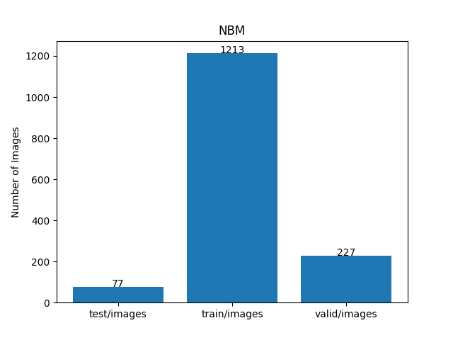 
 

As shown above, the number of images of train and valid datasets is not so large to use for a training set of our segmentation model.
 
 
<b>Train_images_sample</b> 
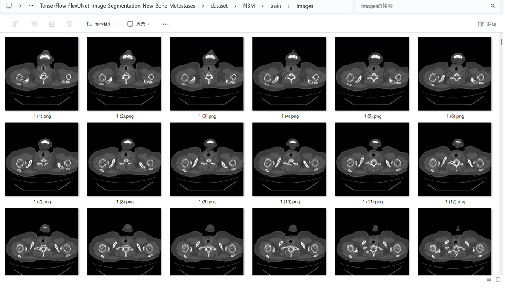
 
<b>Train_masks_sample</b> 
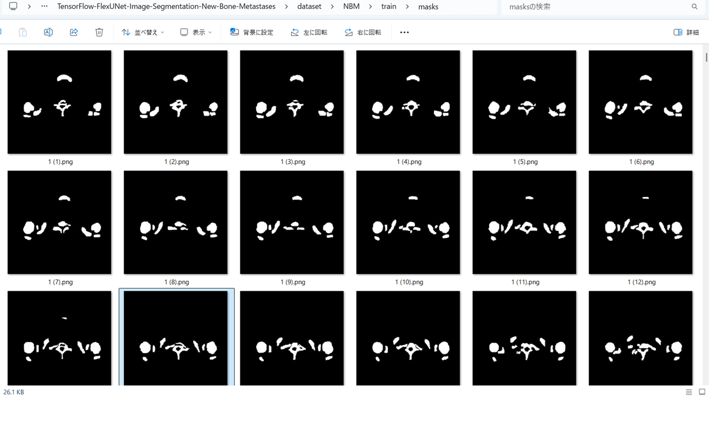
 
<h3>
3 Train TensorFlowFlexUNet Model
</h3>
 We trained NBM TensorFlowFlexUNet Model by using the following
<a href="./projects/TensorFlowFlexUNet/NBM/train_eval_infer.config"> <b>train_eval_infer.config</b></a> file.  
Please move to ./projects/TensorFlowFlexUNet/NBM and run the following bat file. 
<pre>
>1.train.bat
</pre>
, which simply runs the following command. 
<pre>
>python ../../../src/TensorFlowFlexUNetTrainer.py ./train_eval_infer.config
</pre>

<b>Model parameters</b> 
Defined a small <b>base_filters = 16 </b> and large <b>base_kernels = (9,9)</b> for the first Conv Layer of Encoder Block of 
<a href="./src/TensorFlowFlexUNet.py">TensorFlowFlexUNet.py</a> 
and a large num_layers (including a bridge between Encoder and Decoder Blocks).
<pre>
[model]
;You may specify your own UNet class derived from our TensorFlowFlexModel
model         = "TensorFlowFlexUNet"
generator     =  False
image_width    = 512
image_height   = 512
image_channels = 3
num_classes    = 2

base_filters   = 16
base_kernels   = (9,9)
num_layers     = 8
dropout_rate   = 0.04
dilation       = (1,1)
</pre>
<b>Learning rate</b> 
Defined a very small learning rate.  
<pre>
[model]
learning_rate  = 0.00007
</pre>
<b>Loss and metrics functions</b> 
Specified "categorical_crossentropy" and <a href="./src/dice_coef_multiclass.py">"dice_coef_multiclass"</a>. 
<pre>
[model]
loss           = "categorical_crossentropy"
metrics        = ["dice_coef_multiclass"]
</pre>
<b>Dataset class</b> 
Specifed <a href="./src/ImageCategorizedMaskDataset.py">ImageCategorizedMaskDataset</a> class. 
<pre>
[dataset]
class_name    = "ImageCategorizedMaskDataset"
</pre>
 
<b>Learning rate reducer callback</b> 
Enabled learing_rate_reducer callback, and a small reducer_patience.
<pre> 
[train]
learning_rate_reducer = True
reducer_factor     = 0.4
reducer_patience   = 4
</pre>
<b>Early stopping callback</b> 
Enabled early stopping callback with patience parameter.
<pre>
[train]
patience      = 10
</pre>

<b>RGB Color map</b> 
rgb color map dict for NBM 1+1 classes. 
<pre>
[mask]
; 1+1 classes
; RGB colors     NBM:white     
rgb_map = {(0,0,0):0,(255,255,255):1,}

</pre>

<b>Epoch change inference callback</b> 
Enabled <a href="./src/EpochChangeInferencer.py">epoch_change_infer callback (EpochChangeInferencer.py)</a></b>. 
<pre>
[train]
epoch_change_infer       = True
epoch_change_infer_dir   =  "./epoch_change_infer"
num_infer_images         = 6
</pre>

By using this callback, on every epoch_change, the inference procedure can be called
 for 6 images in <b>mini_test</b> folder. This will help you confirm how the predicted mask changes 
 at each epoch during your training process.    

<b>Epoch_change_inference output at starting (epoch 1,2,3)</b> 
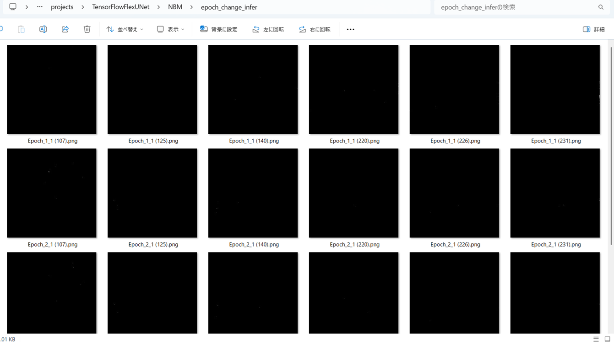 
 
<b>Epoch_change_inference output at middlepoint (epoch 26,27,28)</b> 
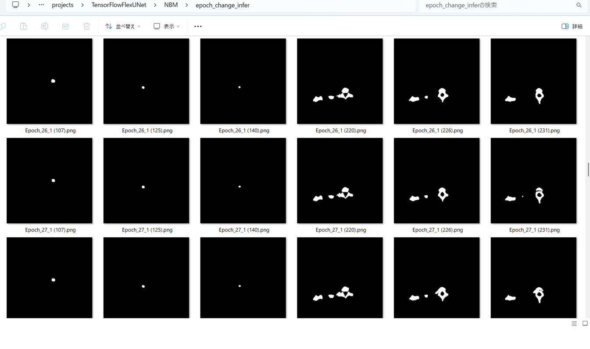 
 
<b>Epoch_change_inference output at ending (epoch 54,55,56)</b> 
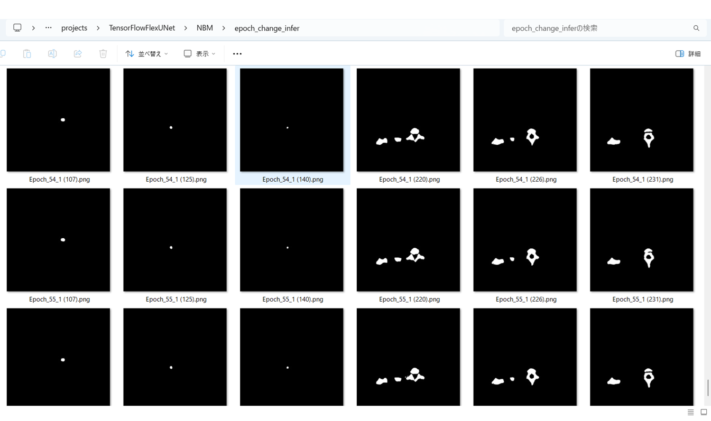 
 
In this experiment, the training process was stopped at epoch 56 by EarlyStoppingCallback.  
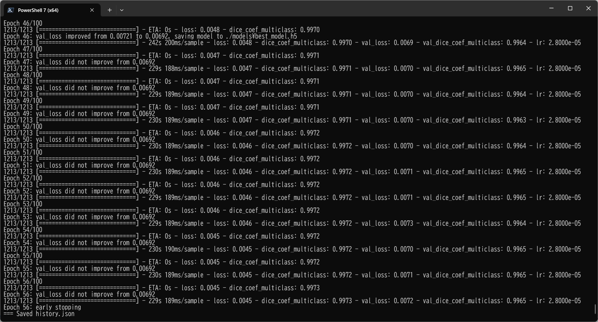 
 
<a href="./projects/TensorFlowFlexUNet/NBM/eval/train_metrics.csv">train_metrics.csv</a> 
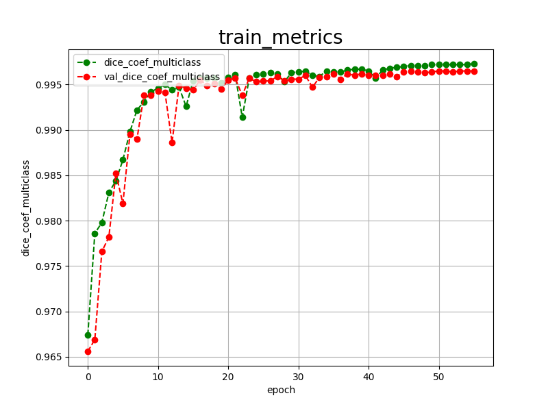 

 
<a href="./projects/TensorFlowFlexUNet/NBM/eval/train_losses.csv">train_losses.csv</a> 
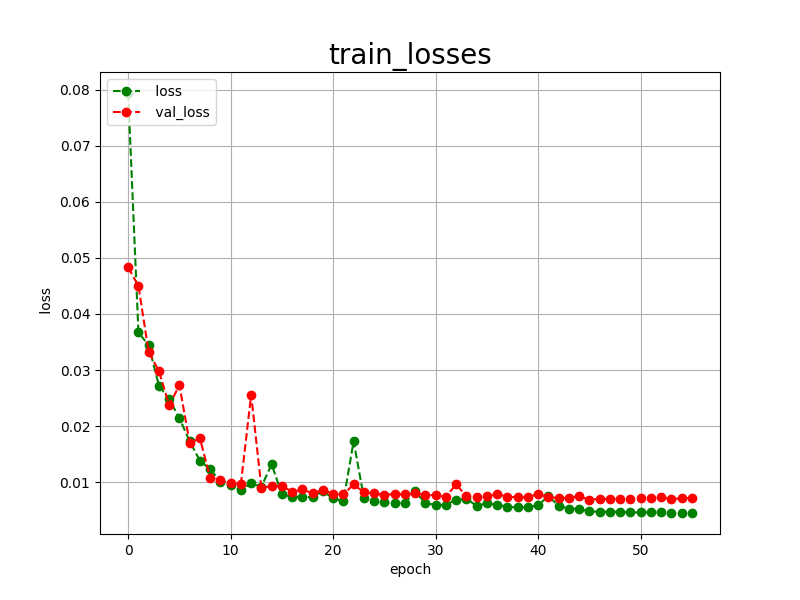 

 

<h3>
4 Evaluation
</h3>
Please move to <b>./projects/TensorFlowFlexUNet/NBM</b> folder, 
and run the following bat file to evaluate TensorFlowFlexUNet model for NBM. 
<pre>
./2.evaluate.bat
</pre>
This bat file simply runs the following command.
<pre>
python ../../../src/TensorFlowFlexUNetEvaluator.py ./train_eval_infer_aug.config
</pre>

Evaluation console output: 
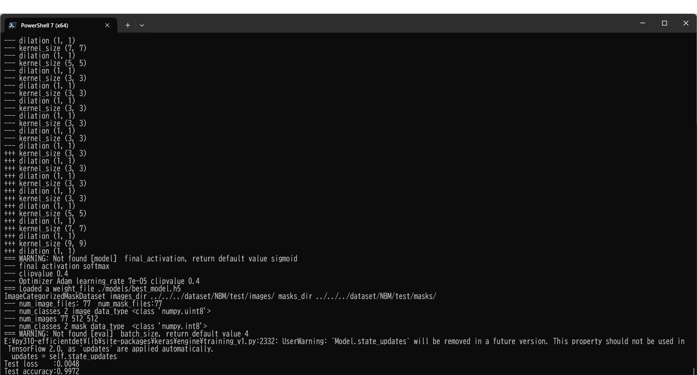
  

<a href="./projects/TensorFlowFlexUNet/NBM/evaluation.csv">evaluation.csv</a> 
The loss (categorical_crossentropy) to this NBM/test was very low and dice_coef_multiclass 
very high as shown below.
 
<pre>
categorical_crossentropy,0.0048
dice_coef_multiclass,0.9972
</pre>
 

<h3>
5 Inference
</h3>
Please move <b>./projects/TensorFlowFlexUNet/NBM</b> folder 
,and run the following bat file to infer segmentation regions for images by the Trained-TensorFlowFlexUNet model for NBM. 
<pre>
./3.infer.bat
</pre>
This simply runs the following command.
<pre>
python ../../../src/TensorFlowFlexUNetInferencer.py ./train_eval_infer_aug.config
</pre>

<b>mini_test_images</b> 
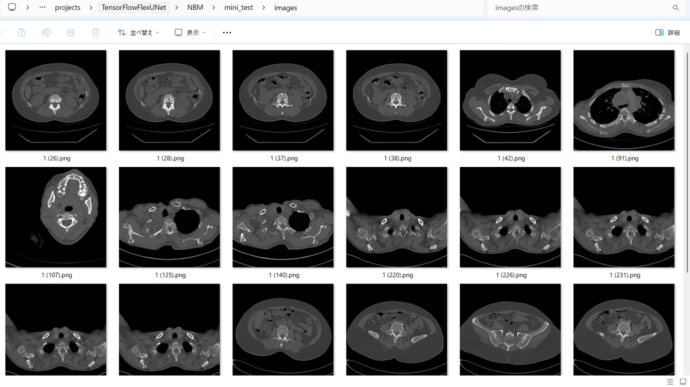 
<b>mini_test_mask(ground_truth)</b> 
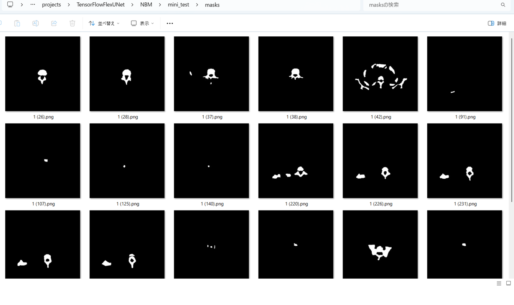 

<b>Inferred test masks</b> 
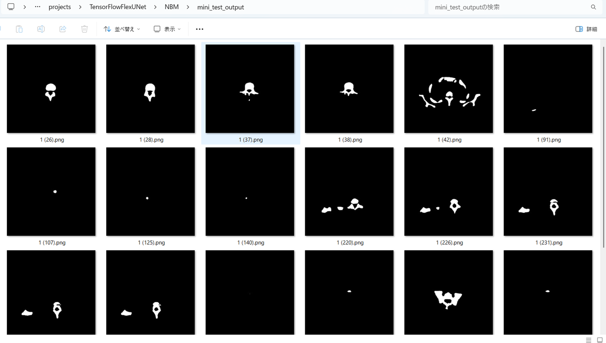 
 

<b>Enlarged images and masks of 512x512 pixels</b> 
<table>
<tr>
<th>Image</th>
<th>Mask (ground_truth)</th>
<th>Inferred-mask</th>
</tr>

<tr>
<td></td>
<td></td>
<td></td>
</tr>

<tr>
<td></td>
<td></td>
<td></td>
</tr>

<tr>
<td></td>
<td></td>
<td></td>
</tr>

<tr>
<td></td>
<td></td>
<td></td>
</tr>

<tr>
<td></td>
<td></td>
<td></td>
</tr>

<tr>
<td></td>
<td></td>
<td></td>
</tr>
</table>

 
<h3>
References
</h3>
<b>1. BM-Seg: A new bone metastases segmentation dataset and ensemble of CNN-based segmentation approach
</b> 
Marwa Afnouch, Olfa Gaddour, Yosr Hentati, Fares Bougourzi, Mohamed Abid, Ihsen Alouani, Abdelmalik Taleb Ahmed
 
<a href="https://www.sciencedirect.com/science/article/abs/pii/S0957417423008783">
https://www.sciencedirect.com/science/article/abs/pii/S0957417423008783
</a>
 
 
<b>2. EH-AttUnetplus : Ensemble of trained Hybrid-AttUnet++ models (EH-AttUnet++)
</b> 
Marwa-Afnouch 
<a href="https://github.com/Marwa-Afnouch/EH-AttUnetplus?tab=readme-ov-file">
https://github.com/Marwa-Afnouch/EH-AttUnetplus?tab=readme-ov-file
</a>
 
 
<b>3. Tensorflow-Image-Segmentation-New-Bone-Metastases </b> 
Toshiyuki Arai @antillia.com 
<a href="https://github.com/sarah-antillia/Tensorflow-Image-Segmentation-New-Bone-Metastases">
https://github.com/sarah-antillia/Tensorflow-Image-Segmentation-New-Bone-Metastases
</a>
 
